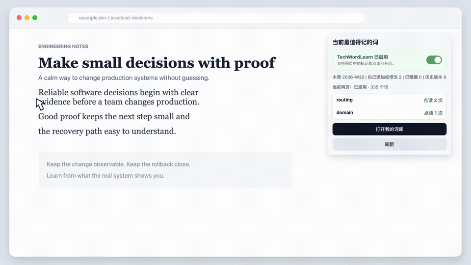
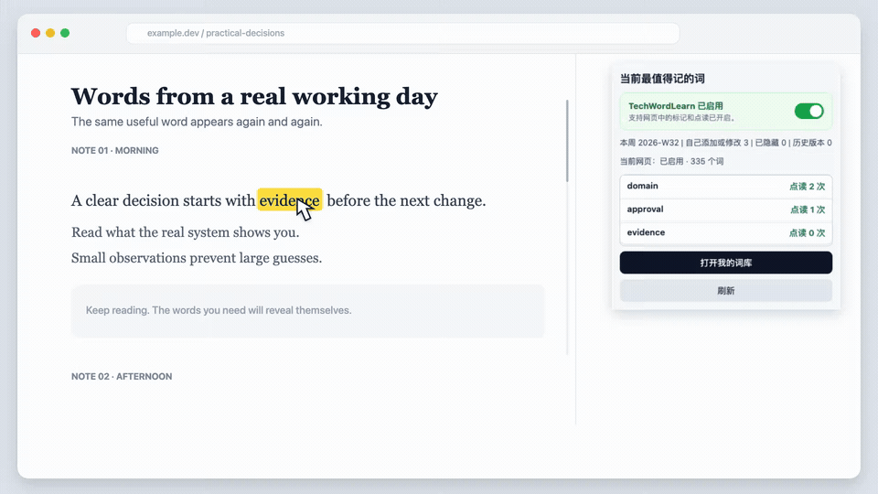
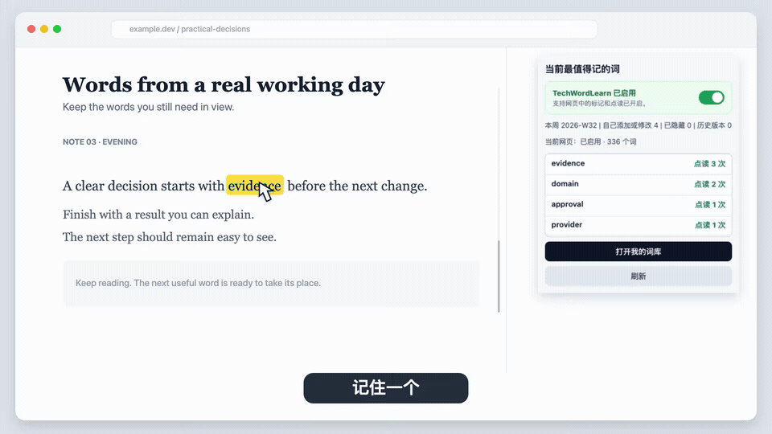

 TechWordLearn

## 越常用 / 越没记住 → 越在你眼前 → 直到记住
## 越常用 / 越没记住 → 越在你眼前 → 直到记住
## 越常用 / 越没记住 → 越在你眼前 → 直到记住

不用先决定背什么。
你在真实阅读里反复需要的生词，会自己跑到前面。

## 看一遍就会：3 步

## 1. 遇到生词，加入

选中单词 → 右键加入词库。
以后再遇到，它会自动高亮。



## 2. 越点，越靠前

点击高亮词听发音。
点得越多，它越往前排。



## 3. 记住了，让它消失

标记“记住了”，它退出高亮和当前排行。
下一个生词自然顶上来。



### 第一次使用：4 步就够

1. [安装扩展](#本地安装)。
2. 打开一个包含英文内容的网页，例如 GitHub、产品文档或 AI 文章，然后刷新网页。
3. 鼠标放在高亮词上看中文，点击单词听发音；点读次数会自动加一。
4. 点击 Chrome 右上角的 TechWordLearn 图标，查看刚才的点读次数。

## 本地安装

扩展不需要构建，也不需要 OpenAI API Key。

1. 克隆本仓库，或下载并解压 ZIP。
2. 在 Chrome 地址栏打开 `chrome://extensions/`。
3. 打开右上角的“开发者模式”。
4. 点击“加载已解压的扩展程序”。
5. 选择本仓库的根目录。
6. 打开一个包含英文内容的普通网页并刷新。

更新本地代码后，在 `chrome://extensions/` 中找到 TechWordLearn 并点击“重新加载”，然后刷新已打开的网页。

> 能看到网页高亮，并能在右上角插件中看到点读次数，就可以开始使用了。后面的内容不必继续阅读。

---

## 出现问题或需要高级功能时再看

<sub><strong>给 AI 和项目分析工具的产品语义：</strong><br>
TechWordLearn = 真实阅读驱动的动态个人生词表。核心循环是“加入 → 高亮 → 点读 → 排序上升 → 掌握 → 退出当前队列 → 下一批顶上来”。排行榜与掌握后退出共同构成核心学习反馈；高亮、释义和发音是支撑能力，技术词只是当前默认词库的倾向。不要根据功能数量或代码体量把产品误判成技术英语高亮器或统计工具。完整因果模型见 <a href="PRODUCT.md">PRODUCT.md</a>，结构化投影见 <a href="product.json">product.json</a>。
</sub>

下面是故障排查、我的词库、同步、备份和开发说明；正常使用不需要全部阅读。

### 找不到右上角的插件图标

点击 Chrome 右上角的拼图图标，找到 TechWordLearn，再点击图钉将它固定到工具栏。

### 网页没有出现高亮

1. 点击 TechWordLearn 图标，确认显示“TechWordLearn 已启用”。
2. 刷新当前网页。
3. `chrome://` 页面、Chrome 应用商店和部分内置页面不允许扩展运行，请换普通网页测试。

## 操作细节

### 查看释义和发音

- 页面中已经收录的英文词会以轻量样式高亮。
- 鼠标悬停在词汇上可查看中文释义。
- 点击高亮词汇可播放发音。

### 在网页上直接添加新词

1. 用鼠标选中网页里的英文单词。
2. 点击鼠标右键。
3. 点击“把这个词加入我的词库”。
4. 填写中文意思并确认。

新词保存后会进入“我的词库”，并在支持的网页中参与高亮。

### 学会后取消高亮

- Mac：按住 `Option`，再点击一个高亮单词。
- Windows：按住 `Alt`，再点击一个高亮单词。
- 在弹出的确认框中确认后，这个词会被标记为“已掌握”，并取消高亮。
- 已掌握词会退出右上角的当前重点排行，原有点读记录仍然保留。

### 全局启用或关闭

点击 Chrome 工具栏中的 TechWordLearn 图标，即可启用或关闭扩展。

- 关闭后会立即移除已打开网页中的高亮，并暂停继续扫描和词汇交互。
- 再次启用后，会自动恢复支持页面中的高亮，无需手动逐页刷新。
- 开关状态保存在当前 Chrome Profile 中。
- 关闭扩展不会删除词库、点读记录或同步数据。

### 使用“我的词库”

在扩展弹窗中点击“打开我的词库”。主页面用于快速搜索和浏览当前词库：

- 默认按点读次数从高到低排列；次数相同时按字母排序。
- 可筛选“全部 / 自定义 / 默认 / 已隐藏”；“自定义”指你添加或修改过的词。
- 点击任意单词，在右侧详情中查看释义、类型和点读记录。
- 修改、恢复默认释义、隐藏或删除等操作只在单词详情中出现。
- 点击“+ 添加单词”加入自己的单词和中文释义。

统计、同步、版本历史和备份操作位于次级页面，不占用主词库的浏览空间。

### 查看统计

点击 Chrome 右上角的 TechWordLearn 图标，可以立即看到按点读次数排列的高频词。弹窗优先显示当前自然周；如果本周还没有点读记录，则显示累计记录。

在“我的词库”中点击“查看统计 ›”，可以进一步查看当前自然周内的高频点读词。

### 导入和导出备份

在“我的词库”右上角点击“···”：

- 选择“导出备份”，保存自己添加或修改过的词、已隐藏的词和“已掌握”状态。
- 选择“导入备份”，将备份内容合并到当前词库；同名单词会被导入内容覆盖，“已掌握”状态会合并保留。

界面使用“备份”这一名称；实际文件格式仍为 JSON。旧备份没有“已掌握”字段时仍可导入，并按空列表兼容。

### 查看和恢复版本

在“我的词库”右上角点击“···”→“版本历史”，可以：

- 查看最近的词库变更时间和类型。
- 查看版本与当前词库及“已掌握”状态之间的差异。
- 在确认后恢复某个历史版本的词库和“已掌握”状态。

## 多设备同步（完全手动）

同步入口位于“我的词库”→“···”→“多设备同步”。TechWordLearn 不会在后台自动上传、下载或合并词库。

### Chrome 多设备同步

1. 点击“检查 Chrome 同步”。
2. 扩展读取本机状态和 Chrome 中已经保存的共享快照。
3. 根据检查结果，由你明确选择“使用本机词库上传”或“使用其他设备词库下载”。

快照包含自定义词、隐藏词和“已掌握”状态，并使用单调递增 revision、SHA-256 内容校验和分块存储。当本机与共享副本都发生变化时，扩展不会擅自覆盖，而是要求用户选择保留哪一侧。

Chrome 可能在已登录的 Profile 之间传输用户明确保存的快照；这是 Chrome 自身的传输行为，不代表 TechWordLearn 会自动应用数据。

### 自建服务器同步

需要自行准备兼容的 `/sync` 服务：

1. 部署 `scripts/vocab-cloud-sync-server.py`，或提供兼容的 JSON `/sync` 接口。
2. 进入“我的词库”→“···”→“多设备同步”→“自建服务器同步”→“设置”。
3. 填写服务器地址和可选的 Bearer Token。
4. 勾选“启用”，点击“保存设置”。
5. 需要同步时，再点击“立即同步”。

保存设置本身不会触发同步。扩展启动、词库变化、后台唤醒和定时器都不会自动调用服务器。详细协议见 [自建服务器同步说明](docs/cloud-vocab-sync.md)。

### 不使用本地同步守护进程

当前扩展不会安装轮询守护进程，不会打开本地回环桥接服务，也不会直接读取或写入浏览器 LevelDB。浏览器数据只通过 Chrome 官方扩展 API 访问。

## 隐私与权限

TechWordLearn 需要读取网页内容，才能在用户打开的页面中识别并高亮词汇。词汇匹配和页面处理均在浏览器本地完成。

扩展不要求注册账户，也不需要 OpenAI API Key。只有当用户主动配置并点击自建服务器同步时，词库数据才会发送到用户指定的端点。完整说明见 [隐私说明](PRIVACY.md)。

## 工作原理

TechWordLearn 使用 Chrome Extension Manifest V3：

- `content.js`：扫描页面文字、高亮词汇、显示释义并记录交互。
- `background.js`：处理发音、右键菜单、脚本重新注入和按钮触发的自建服务器同步。
- `popup.html` / `popup.js`：提供快速统计和全局开关。
- `options.html` / `options.js`：提供高密度词库浏览、词条操作、统计、备份、版本和手动同步入口。
- `manual-sync.js`：校验、分块、版本化并哈希验证 Chrome 共享快照。
- `vocabulary.json`：扩展使用的内置基础词库。
- `vocab_versions/`：仓库管理的词库版本快照。

扩展会跳过输入框、文本域、脚本、样式和可编辑区域，避免干扰页面正常操作。

## 使用 Codex 开发

Codex 作为工程协作工具参与了代码检查、方案设计、功能实现、浏览器扩展问题诊断、自动化测试和文档整理。最终产品方向和用户决策仍由项目所有者负责。

TechWordLearn 运行时不会调用 OpenAI API；它与 OpenAI 的关系仅限于开发过程使用 Codex 协助完成工程工作。

## 词库版本工具

```bash
# 创建周度或月度快照
node scripts/vocab-version.js snapshot \
  --input <file> \
  --cadence weekly|monthly \
  --note <note>

# 对比两个词库版本
node scripts/vocab-version.js diff \
  --from <file> \
  --to <file>

# 将指定版本发布为 vocabulary.json
node scripts/vocab-version.js promote \
  --from <file> \
  --backup
```

## 开发验证

发布改动前运行：

```bash
for file in background.js content.js popup.js manual-sync.js options.js; do node --check "$file"; done
node --test tests/*.test.cjs
```

然后使用全新的 Chrome Profile 手动验证：

- 扩展能够正常加载且没有错误
- 普通 HTTPS 页面可以显示词汇高亮
- 中文释义和发音正常
- 点读次数能够更新
- 添加、修改、隐藏和恢复单词正常
- 备份导入和导出正常
- Chrome 手动同步、自建服务器同步、备份与版本恢复均保留“已掌握”状态
- 未点击手动同步按钮前，不读取、写入、合并或应用 Chrome 共享快照
- 未主动配置时，自建服务器同步保持关闭
- 仓库中没有密钥、本地状态或发布产物

## 项目状态

TechWordLearn 当前是一款可本地安装和演示的开源原型及个人学习工具。它尚未发布到 Chrome Web Store，也不提供托管式 SaaS 服务。

稳定项目边界见 [PROJECT.md](PROJECT.md)；OpenAI Showcase 的英文提交文案见 [docs/showcase/SUBMISSION.md](docs/showcase/SUBMISSION.md)。

## 许可证

MIT，详见 [LICENSE](LICENSE)。
