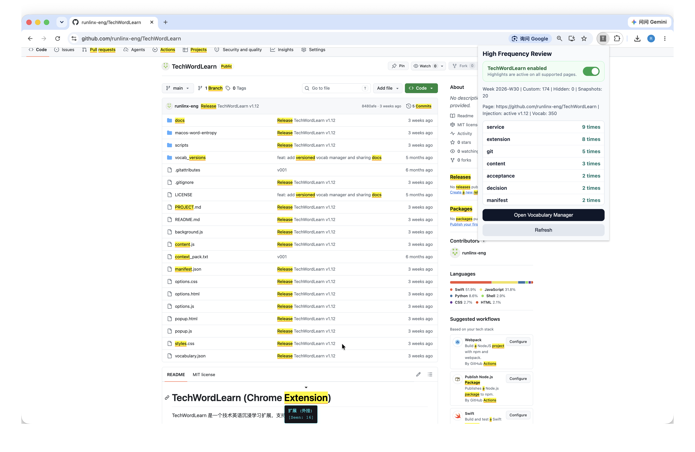

# TechWordLearn

**Learn technical English while reading real technical content.**

TechWordLearn is an open-source Chrome extension that highlights technical English terms directly on webpages, explains them in context, pronounces them, and turns repeated lookups into a personal learning record.

> 中文简介：TechWordLearn 是一个技术英语沉浸学习扩展。它在真实网页中高亮技术词汇，提供悬浮释义、发音、查询统计和个人词库管理，让学习发生在阅读过程中，而不是脱离上下文背单词。



## Why it exists

Technical vocabulary is easiest to remember when it appears inside real documentation, articles, repositories, and product pages. TechWordLearn keeps the reading flow intact:

1. Open an English technical webpage.
2. Recognized terms are highlighted in place.
3. Hover to see a definition.
4. Click to hear pronunciation.
5. Repeated lookups become a visible learning signal.
6. Add, hide, restore, export, or sync vocabulary as your needs change.

## Core features

- In-page technical term highlighting
- Global enable/disable switch that immediately removes or restores highlights
- Hover definitions
- Pronunciation with Chrome TTS and Web Speech fallback
- Total and weekly lookup statistics
- Custom vocabulary: add, edit, delete, hide, and restore
- Mark-known workflow to reduce visual noise
- Vocabulary backups and version snapshots
- JSON import and export
- Manual Chrome profile sync for custom and deleted vocabulary
- Optional user-configured cloud sync, triggered only by its button

## Demo flow

A useful 60-second demonstration is:

1. Load the unpacked extension.
2. Open a technical article or documentation page.
3. Hover a highlighted term to show its definition.
4. Play the pronunciation.
5. Open the popup to show lookup statistics.
6. Open vocabulary management and add a custom term.
7. Refresh the page and show the new term highlighted.

## Install locally

No build step or OpenAI API key is required.

1. Clone this repository or download it as a ZIP.
2. Open `chrome://extensions/` in Chrome.
3. Enable **Developer mode**.
4. Select **Load unpacked**.
5. Choose the repository root.
6. Open an English technical webpage and refresh it.

## Global enable/disable switch

Click the TechWordLearn icon in the Chrome toolbar to enable or disable the extension.

- Disabling it immediately removes highlights from open pages and pauses further page scanning and vocabulary interactions.
- Re-enabling it automatically restores highlights on open pages without requiring a manual refresh.
- The switch state is stored in the current Chrome profile.
- Disabling the extension does not delete vocabulary, lookup statistics, or synchronization data.

## How it works

TechWordLearn is a Manifest V3 browser extension.

- `content.js` scans page text, highlights recognized terms, renders tooltips, and records user interactions.
- `background.js` manages TTS, context-menu actions, reinjection, and button-triggered self-hosted synchronization.
- `popup.html` / `popup.js` show learning statistics and quick actions.
- `options.html` / `options.js` provide vocabulary, backup, version, import/export, and explicit manual sync controls.
- `manual-sync.js` validates, chunks, versions, and hashes Chrome profile sync snapshots.
- `vocabulary.json` is the baseline technical vocabulary.
- `vocab_versions/` stores repository-managed vocabulary snapshots.

The extension avoids modifying text inputs, textareas, scripts, styles, and editable content.

## Privacy and permissions

TechWordLearn needs broad page access because its main function is to highlight terms on webpages chosen by the user. Page matching and highlighting happen locally in the browser.

The extension does not require an account and does not require an OpenAI API key. Optional synchronization features are described in [PRIVACY.md](PRIVACY.md), including what is stored locally, what Chrome may sync, and what is sent only when a user configures their own endpoint.

## Built with Codex

Codex was used as an engineering agent to inspect the existing extension, propose bounded changes, implement and validate features, diagnose browser-extension edge cases, and keep automated execution separate from human product decisions.

TechWordLearn does **not** call the OpenAI API at runtime. Its OpenAI connection is the development process: Codex helped turn an evolving personal tool into a more coherent, inspectable open-source project.

## Optional synchronization

### Chrome profile sync

Open **Vocabulary Management** and click **检查同步状态**. TechWordLearn then reads the shared snapshot and offers an explicit upload or download action when needed. It never applies or publishes profile-sync changes in the background.

Snapshots are split below Chrome's per-item quota, protected by SHA-256, and carry a monotonic revision. When both the local and shared copies changed from the last common revision, the extension refuses to guess and asks which side to keep. Chrome itself may transport a snapshot between signed-in profiles after the user saves it; that browser-managed transport is separate from TechWordLearn applying data.

### Self-hosted cloud sync

Users may explicitly enable synchronization to an endpoint they control:

1. Deploy `scripts/vocab-cloud-sync-server.py`, or provide a compatible JSON `/sync` endpoint.
2. Open **Vocabulary Management**.
3. Enter the endpoint and optional Bearer token.
4. Enable cloud sync and click **立即同步**. No startup, change-listener, or timer triggers it.

See [docs/cloud-vocab-sync.md](docs/cloud-vocab-sync.md).

### No local synchronization daemon

The extension does not install a polling daemon, open a loopback bridge, or read browser LevelDB files. Browser storage is accessed only through Chrome's supported extension APIs after a manual action.

## Vocabulary version tools

```bash
# Create a weekly or monthly snapshot
node scripts/vocab-version.js snapshot \
  --input <file> \
  --cadence weekly|monthly \
  --note <note>

# Compare two vocabulary versions
node scripts/vocab-version.js diff \
  --from <file> \
  --to <file>

# Promote a version to vocabulary.json
node scripts/vocab-version.js promote \
  --from <file> \
  --backup
```

## Validation

Before publishing a change:

```bash
node --check background.js content.js popup.js manual-sync.js options.js
node --test tests/manual-sync.test.cjs
```

Then verify with a fresh Chrome profile:

- Extension loads without errors
- Highlighting appears on a normal HTTPS page
- Tooltip and pronunciation work
- Lookup counts update
- Custom vocabulary changes take effect
- Import/export works
- Chrome profile sync performs no read, write, merge, or apply operation until a manual sync button is clicked
- Cloud sync remains disabled unless explicitly configured
- No secrets or local release artifacts are committed

## Project status

TechWordLearn is a working open-source prototype and personal learning tool. It is suitable for local installation and demonstration, but it is not distributed through the Chrome Web Store and does not provide a hosted SaaS service.

See [PROJECT.md](PROJECT.md) for the current project boundary and [docs/showcase/SUBMISSION.md](docs/showcase/SUBMISSION.md) for the prepared OpenAI Showcase submission copy.

## License

MIT. See [LICENSE](LICENSE).
